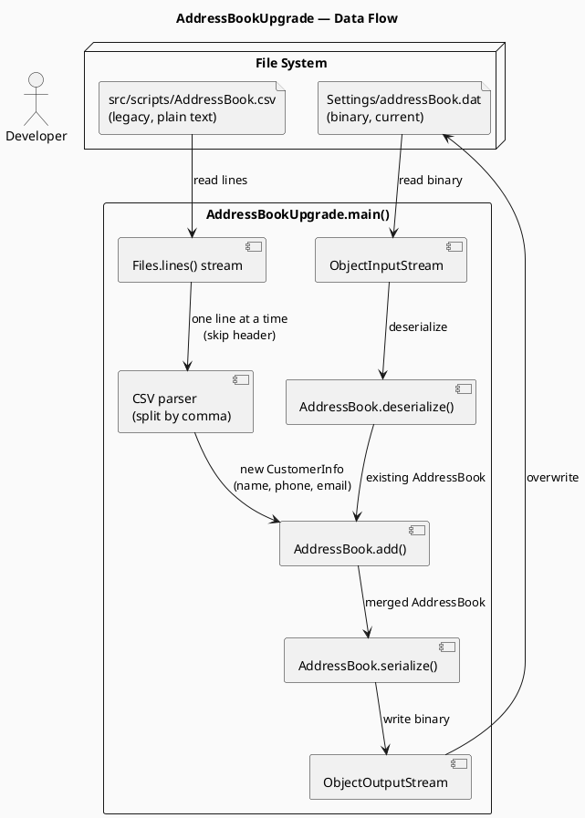

# AddressBookUpgrade.java — Code Explanation

## Analogy: Moving Contacts to a New Phone

Imagine you've been using an old phone where contacts were stored in a plain notes app (CSV). You just got a new phone with a proper Contacts app (binary `.dat` format). The `AddressBookUpgrade` script is like a **one-time sync tool** that:

1. Opens your new phone's Contacts app (loads the existing `addressBook.dat`)
2. Opens the notes from your old phone (reads `AddressBook.csv`)
3. Copies the old contacts into the new Contacts app (merges entries)
4. Saves the updated Contacts app back to the new phone (re-serializes the `.dat` file)

---

## Diagram



---

## Step-by-Step Walkthrough

### Step 1 — Load the existing address book (`addressBook.dat`)

```java
ObjectInputStream ois = new ObjectInputStream(new FileInputStream(PathUtils.ADDRESS_BOOK_DAT_FILE))
AddressBook addressBook = AddressBook.deserialize(ois);
```

`AddressBook.deserialize()` reads the binary `.dat` file field-by-field: it first reads an `int` (the count), then loops reading `name`, `phone`, `email` as UTF strings — rebuilding the full list of `CustomerInfo` objects.

### Step 2 — Stream the old CSV file line by line

```java
Stream<String> stream = Files.lines(Paths.get("src/scripts/AddressBook.csv"))
stream.forEach(line -> { ... });
```

`Files.lines()` is a lazy Java 8 stream — it reads one line at a time without loading the whole file into memory. This is good practice for potentially large files.

### Step 3 — Skip the header, parse each data row

```java
if (!line.equals(ADDRESS_BOOK_CSV_FILE_HEADER)) {
    final String[] split = line.split(",", -1);
    String name  = split[0].trim();
    // ... addressName, street, city, province, postalCode (splits 1–5, unused)
    String phone = split[6].trim();
    String email = split[7].trim();
```

The CSV has **8 columns** (Name, AddressName, Street, City, Province, PostalCode, Phone, Email), but the new `CustomerInfo` only stores **3** (name, phone, email). The address fields (indices 1–5) are **silently dropped** — they are parsed but never used.

The `-1` limit in `split(",", -1)` is important: it preserves trailing empty fields. Without it, `"Alice,,,"` would give only `["Alice"]` instead of `["Alice", "", "", ""]`.

### Step 4 — Add to the address book (deduplication included)

```java
addressBook.add(new CustomerInfo(name, phone, email));
```

`AddressBook.add()` checks `!entries.contains(customerInfo)` before inserting — so if a customer already exists in the `.dat` file, they won't be duplicated. After any successful add, the list is **re-sorted alphabetically** by name.

### Step 5 — Save back to the same `.dat` file

```java
ObjectOutputStream os = new ObjectOutputStream(new FileOutputStream(PathUtils.ADDRESS_BOOK_DAT_FILE))
addressBook.serialize(os);
```

This **overwrites** the original file with the merged result. `serialize()` writes count → then for each entry: name, phone, email as UTF strings.

---

## Gotcha: Address Data Is Silently Discarded

The CSV has 8 columns including a full mailing address (street, city, province, postal code). The script reads all 8 columns but only passes `name`, `phone`, and `email` to `CustomerInfo` — **the address fields are thrown away**.

```java
// These are parsed but never used:
String addressName       = split[1].trim();
String addressStreet     = split[2].trim();
String addressCity       = split[3].trim();
String addressProvince   = split[4].trim();
String addressPostalCode = split[5].trim();
```

This makes sense if the new app no longer has an address field, but it means running this script on a CSV that has unique address data will **permanently lose that information** once the `.dat` is overwritten. There's no backup step.

---

## Summary

| What | How |
|---|---|
| Source format | CSV with 8 columns (legacy) |
| Target format | Binary `.dat` via Java serialization |
| Fields migrated | Name, Phone, Email only |
| Fields dropped | Full mailing address (5 columns) |
| Deduplication | Yes — `AddressBook.add()` checks equality |
| Sorting | Yes — re-sorted alphabetically after each add |
| Run frequency | One-time migration script |