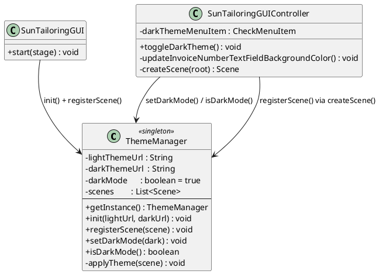
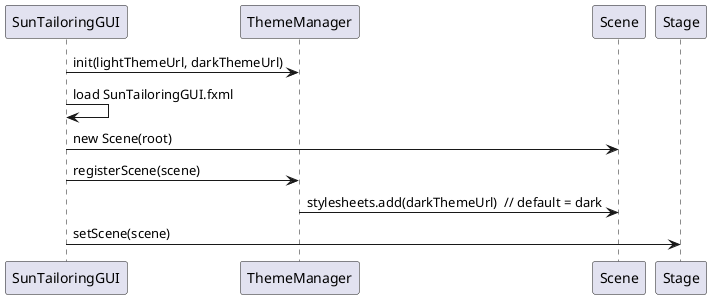
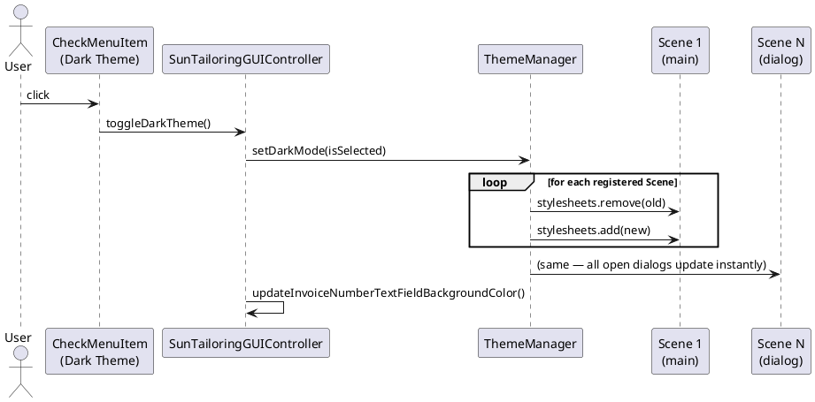

# Theme Switching

SunTailoringFX supports light and dark themes, switchable at runtime via **Settings → Dark Theme**. The default theme on startup is **dark**.

## CSS Files

| File | Purpose |
|------|---------|
| `src/GUI/StyleSheets/LightTheme.css` | Explicit Modena-based light theme — sets `-fx-base`, `-fx-background`, panel backgrounds |
| `src/GUI/StyleSheets/DarkTheme.css` | Dark theme — overrides all control colors, backgrounds, text, scrollbars, calendar cells |
| `src/GUI/StyleSheets/Calendar.css` | Calendar-specific structural styles and light-mode calendar cell colors (node-level) |

> **Note:** `DarkTheme.css` uses `.root .calendar_pane` (specificity 0,2,0) to override `Calendar.css`'s `.calendar_pane` (specificity 0,1,0), which is applied at the node level via FXML.

Theme CSS is applied **only at the `Scene` level** — never embedded in FXML files. This is required so that `ThemeManager` can add and remove the stylesheet at runtime.

---

## ThemeManager

`src/GUI/ThemeManager.java` is a singleton that owns all theme state.



---

## Startup Sequence



---

## Theme Toggle (Runtime)



---

## Dialog Scene Registration

Every dialog opened via `SunTailoringGUIController` calls the private helper:

```java
private Scene createScene(Parent root) {
    Scene scene = new Scene(root);
    ThemeManager.getInstance().registerScene(scene);
    return scene;
}
```

`registerScene` immediately applies the current theme and attaches a window listener that removes the scene from the tracked list when the dialog closes.

---

## Invoice Number Field State Colors

The Invoice Number text field uses an **inline style** (`node.setStyle(...)`) so it always wins over stylesheet rules. Colors per state:

| State | Light | Dark |
|-------|-------|------|
| New (unsaved) | `lightgreen` | `#2d5a2d` |
| Edited (unsaved changes) | `lightpink` | `#5a2d2d` |
| Saved | _(cleared — theme CSS takes over)_ | _(cleared — theme CSS takes over)_ |

The inline style is re-evaluated whenever the invoice state changes **or** when the theme is toggled.